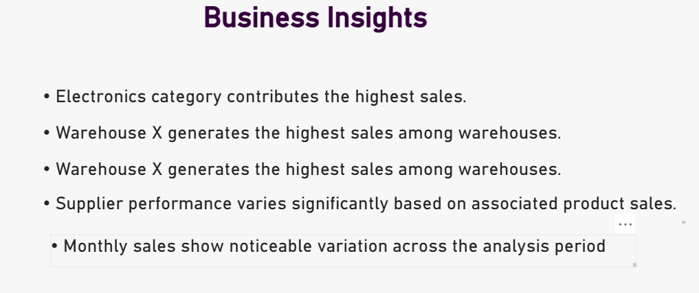
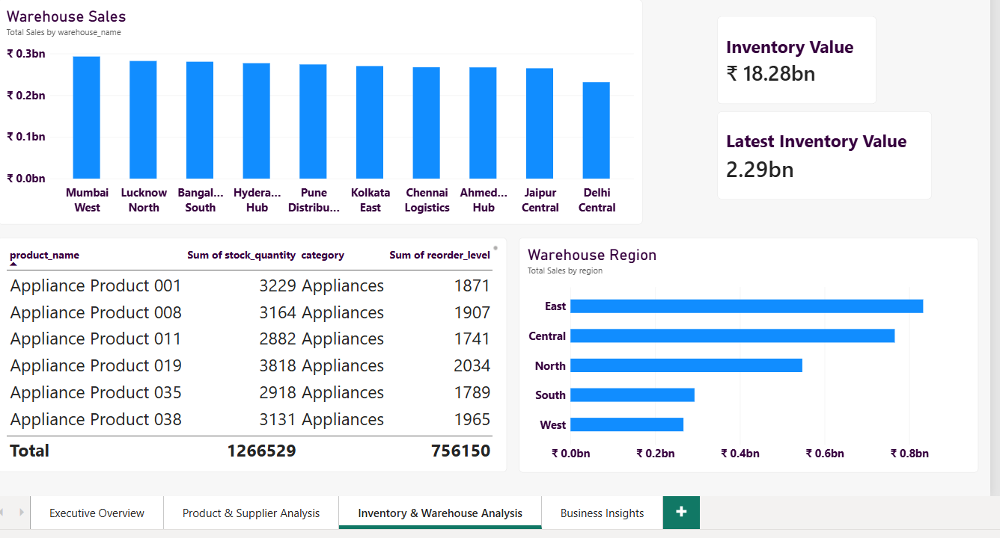
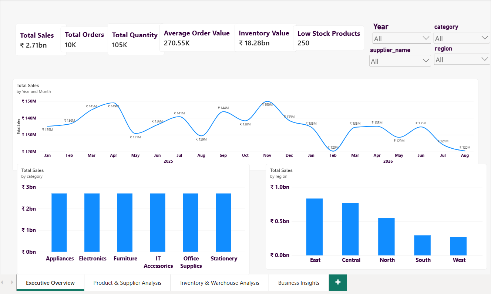

# Supply Chain & Inventory Analytics

## Project Overview

This project uses PostgreSQL and SQL to analyze supply chain operations, product sales, supplier performance, warehouse performance, and inventory levels.

The analysis focuses on answering business questions using relational data, multi-table joins, aggregations, conditional logic, subqueries, and Common Table Expressions (CTEs).

## Tools & Technologies

- PostgreSQL
- pgAdmin
- SQL
- INNER JOIN and LEFT JOIN
- GROUP BY and HAVING
- Aggregate Functions
- CASE WHEN
- Subqueries
- Common Table Expressions (CTEs)

## Database Structure

The project uses five related tables.

### 1. Products
- Product_ID
- Product_Name
- Category
- Supplier_ID
- Unit_Cost

### 2. Suppliers
- Supplier_ID
- Supplier_Name
- Country
- Lead_Time_Days

### 3. Orders
- Order_ID
- Order_Date
- Product_ID
- Warehouse_ID
- Quantity
- Sales

### 4. Inventory
- Product_ID
- Warehouse_ID
- Stock_Date
- Stock_Quantity
- Reorder_Level

### 5. Warehouses
- Warehouse_ID
- Warehouse_Name
- Region

## SQL Analysis

The project covers the following types of analysis:

- Supplier-wise sales analysis
- Warehouse-wise sales analysis
- Category-wise sales performance
- Product-level sales and quantity analysis
- Products with sales above the average
- Low-stock product identification
- Inventory status analysis
- Warehouse and category performance comparisons

## Business Questions

1. Which suppliers are associated with products generating sales?
2. How much sales does each warehouse generate?
3. Which product categories generate higher sales?
4. Which products have sales above the average product sales?
5. Which products have stock at or below their reorder level?
6. How do product sales and quantities compare?
7. Which warehouses and products are associated with customer orders?
8. Which suppliers contribute the most to sales?
9. What inventory items may require replenishment?

## SQL Concepts Demonstrated

- Joining related tables using common identifiers
- Summarizing data with aggregate functions
- Grouping results using GROUP BY
- Filtering grouped results using HAVING
- Categorizing records using CASE WHEN
- Comparing results with subqueries
- Organizing multi-step analysis using CTEs

## Repository Structure

- `README.md` — Project documentation
- `SQL/` — SQL queries organized by analysis topic
- `screenshots/` — Screenshots analysis

## Key Learning

This project demonstrates practical SQL skills for analyzing relational business data, comparing supplier and warehouse performance, evaluating product sales, and identifying potential inventory replenishment needs.

## Repository Purpose

This project showcases hands-on PostgreSQL and SQL experience relevant to entry-level Data Analyst roles.

## Dashboard Preview

